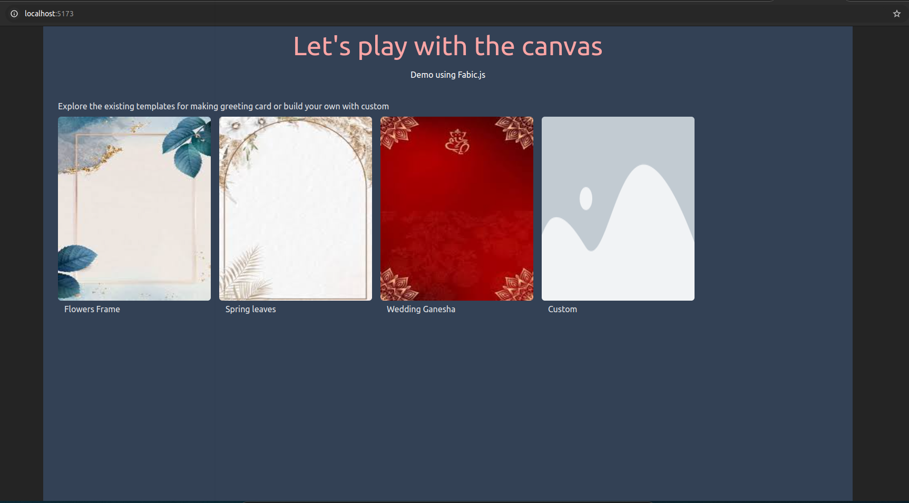

# React + TypeScript + Vite

## Install dependencies
1. Install pnpm globally
2. Run the following commands:
    ```sh
    pnpm install
    pnpm run dev
    ```

## React Custom Implementation

### Card Maker
**Description:**  
Prepare the demo using Fabric.js. There will be predefined templates for cards. Users can modify and download them. Users also have the feature to prepare a custom card.

### Key Features:
- Added a custom hook for canvas element selection.
- Developed custom state management (store) using React context.

---

## Quick Tour

**Check the quick tour:**

[](./src/assets/working-demo/ReactCustom.mp4)

---

